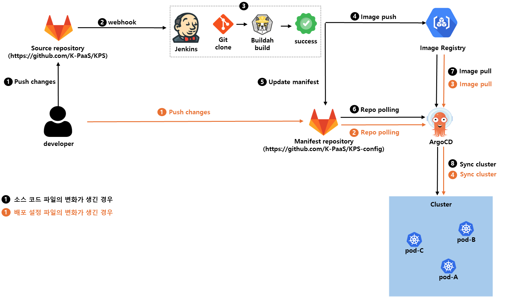

# CI/CD 템플릿

## 소개

쿠버네티스 클러스터에 자체 CI/CD 파이프라인을 구축하는 방법에 대한 가이드 및 활용 가이드를 다루고 있다. 

 
 

**\<파이프라인 구성도 예시>**

 
 

##### ※ CI/CD 서비스를 자체 구축하고자 하는 경우, 공모전 사무국에 노드 스펙 업그레이드를 요청한다. (최소 사양 vCPU 2EA Memory 8GB)

 

## Install

- CI/CD 서비스 배포
    - [CI/CD 서비스 배포 가이드](guide/install-guide/install-guide.md)

## Use

- CI/CD 서비스 사용
    - [CI/CD 서비스 사용 가이드](guide/use-guide/use-guide.md)

