# 사용 가이드

## 목차

[1. 개요](#1-개요) 
- [1.1. 문서 개요](#11-문서-개요) 
- [1.2. 참고 자료](#12-참고-자료) 
[2. 환경 설정](#2-환경-설정) 
- [2.1. Gitlab 사용](#21-gitlab-사용) 
    - [2.1.1. 대시보드 접속](#211-대시보드-접속) 
    - [2.1.2. Access token 생성](#212-access-token-생성) 
    - [2.1.3. 프로젝트 Import](#213-프로젝트-import) 
    - [2.1.4. Webhook 생성](#214-webhook-생성) 
    - [2.1.5. Clone URL 변경](#215-clone-url-변경) 
- [2.2. ArgoCD 사용](#22-argocd-사용) 
    - [2.2.1. 대시보드 접속](#221-대시보드-접속) 
    - [2.2.2. repository 연결](#222-repository-연결) 
    - [2.2.3. application 연동](#223-application-연동) 
- [2.3. Jenkins 사용](#23-jenkins-사용) 
    - [2.3.1. 대시보드 접속](#231-대시보드-접속) 
    - [2.3.2. Credentials 등록](#232-credentials-등록) 
    - [2.3.3. Gitlab connection 등록](#233-gitlab-connection-등록) 
    - [2.3.4. Pipeline 생성](#234-pipeline-생성) 
    - [2.3.5. Pipeline 설정](#235-파이프라인-설정) 

# 1. 개요

## 1.1. 문서 개요

Gitlab, Jenkins, ArgoCD를 연동하는 방법에 대한 사용 가이드를 다루고 있다.

## 1.2. 참고 자료

> https://www.jenkins.io/doc/ 
> https://argo-cd.readthedocs.io/en/stable/getting_started/ 
> https://docs.gitlab.com/ 

# 2. 환경 설정

## 2.1. Gitlab 사용

### 2.1.1. 대시보드 접속

Gitlab 대시보드에 접속한다.

**Gitlab URL**: `http://<NODE PUBLIC IP>:<Gitlab NodePort>`

**사용자 로그인**

- Gitlab 배포 시 확인한 사용자 정보로 로그인한다.

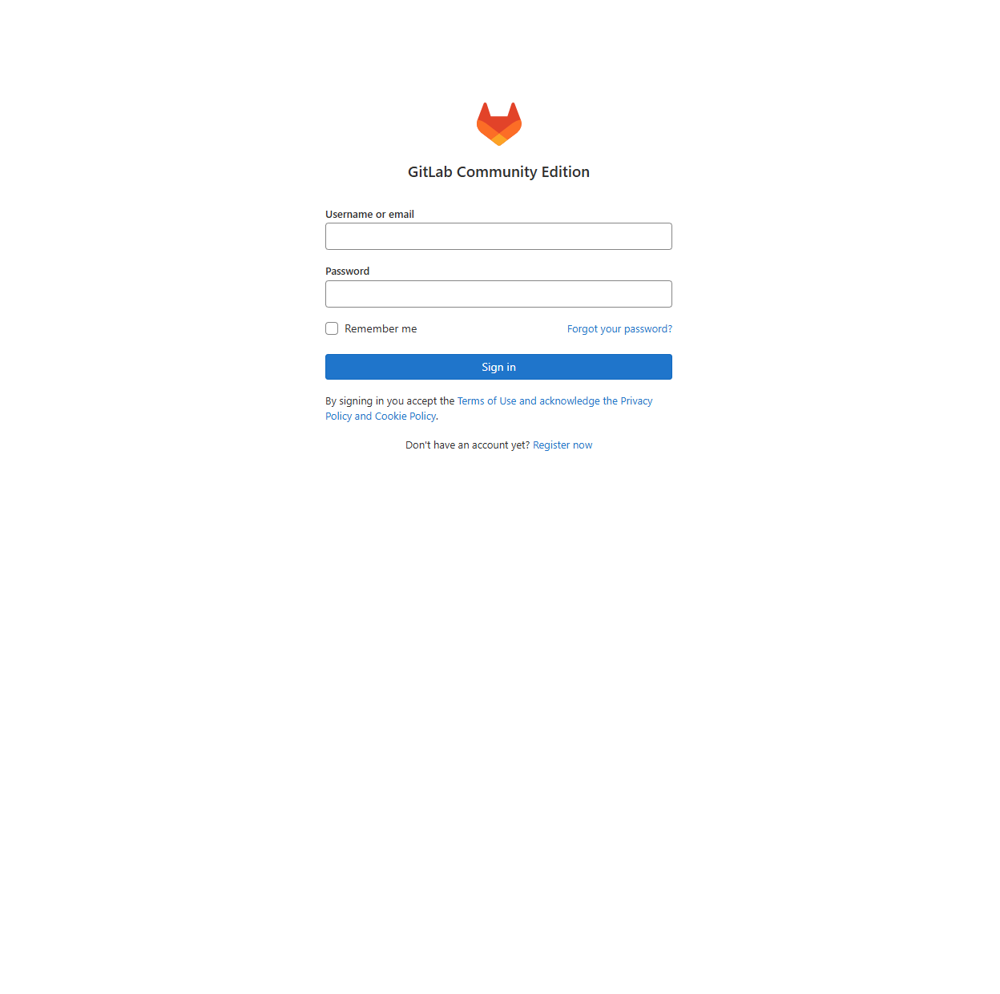

### 2.1.2. Access Token 생성

<strong>[ 프로필 이미지 > Preferences > Access Tokens ]</strong>를 클릭하여 Access Token 관리 페이지에 접속한다.

파이프라인에서 프로젝트에 접근 시 필요한 토큰을 생성하기 위한 과정으로 아래 내용을 입력한 후 **Create personal access token** 버튼을 클릭하면 토큰이 생성된다.

1. **Token name**: 생성할 토큰명
2. **Expiration date**: 토큰 유효 기간
3. **Selec scopes**: 토큰 사용 범위

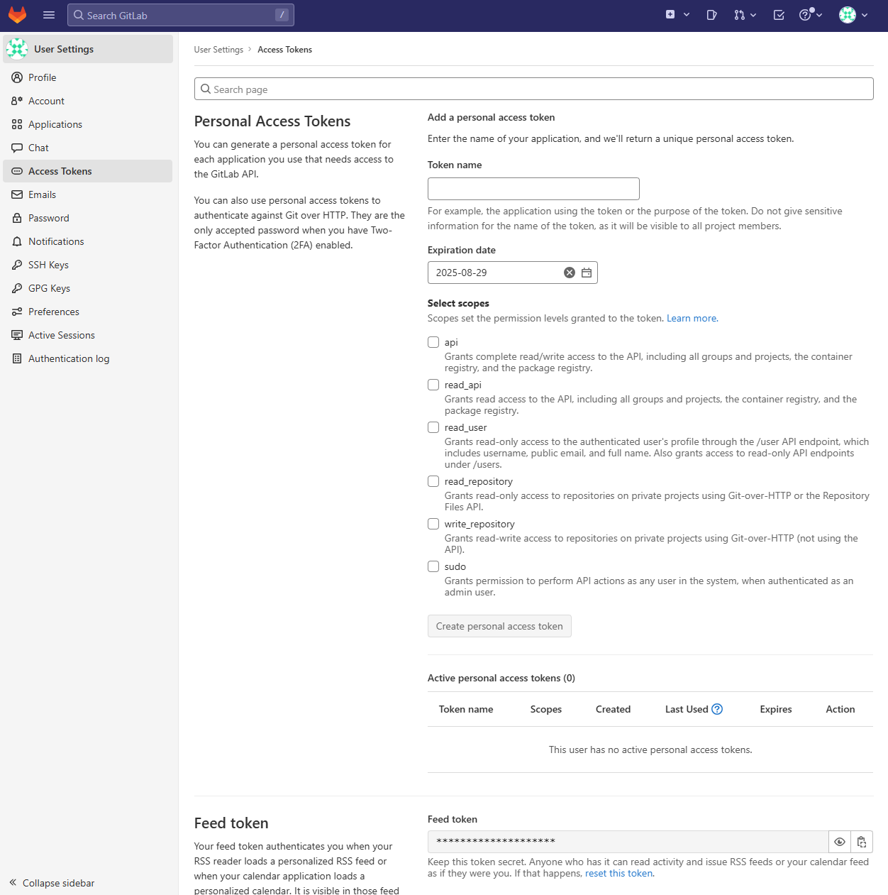

### 2.1.3. 프로젝트 import

<strong>[ 대시보드 > New project > Import project > Repository by URL ]</strong>을 클릭하여 프로젝트 import 페이지에 접속한다. 

Github repository를 import하기 위한 과정으로 아래 내역을 입력한 후 **Create project** 버튼을 클릭하면 프로젝트가 생성된다.

1. **Git repository URL**: 불러올 repository의 URL
2. **Username**: 비공개 repository인 경우 입력 (optional)
3. **Password**: 비공개 repository인 경우 입력 (optional)
4. **Project name**: 생성할 프로젝트명
5. **Project URL & Project slug**: 생성할 프로젝트 URL
6. **Visibility Level**: 생성할 프로젝트의 공개 여부

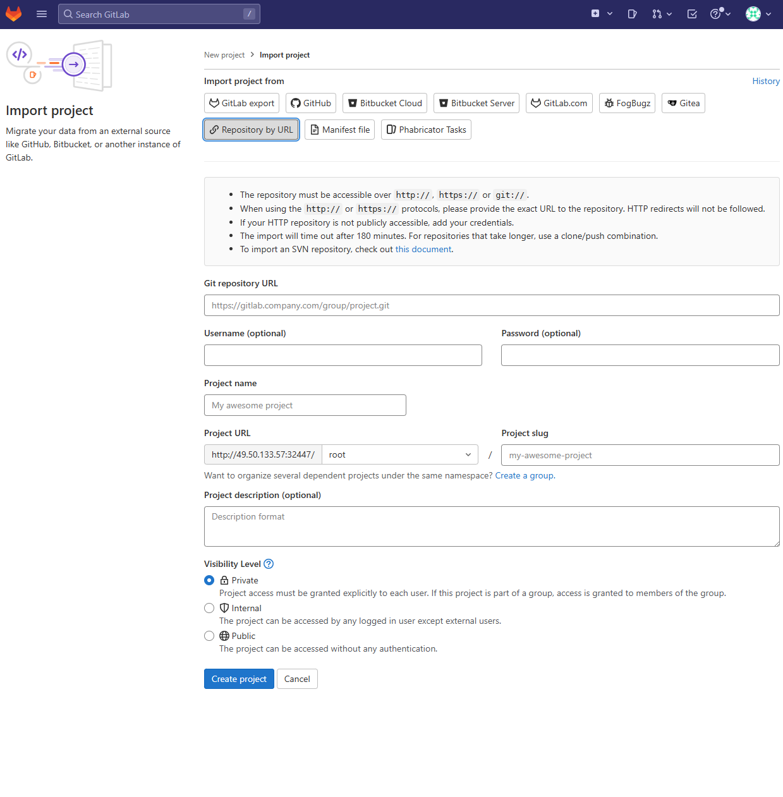

### 2.1.4. Webhook 생성

<strong>[ 대시보드 > webhook을 생성할 프로젝트 > Settings > Webhooks ]</strong>를 클릭하여 webhook 관리 페이지에 접속한다.

Webhook을 생성하기 위한 과정으로 아래 내역을 입력한 후 **Add webhook** 버튼을 클릭하면 webhook이 생성된다.

1. **URL**: jenkins 파이프라인의 URL ([참고] [Jenkins URL 및 token 확인](#235-pipeline-설정))
2. **Secret token**: jenkins 파이프라인의 토큰 ([참고] [Jenkins URL 및 token 확인](#235-pipeline-설정))
3. **Trigger**: 원하는 트리거 유형

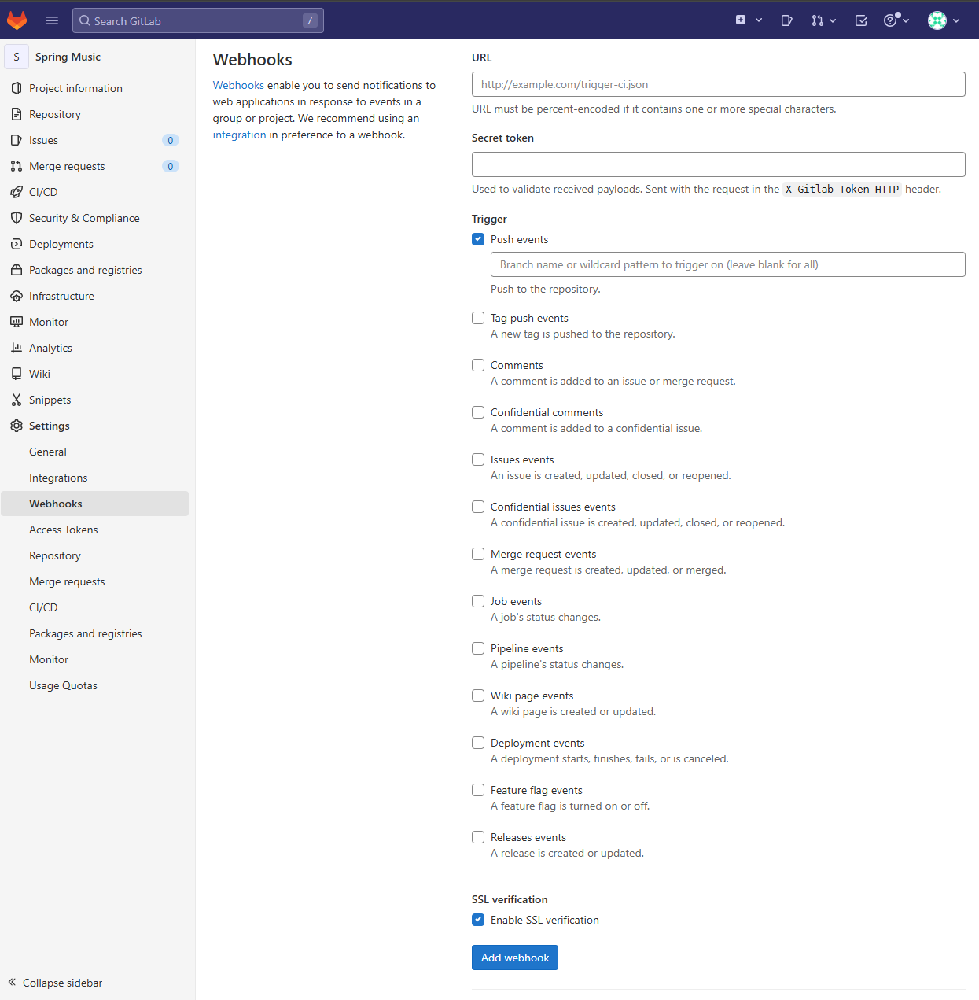

### 2.1.5. Clone URL 변경

<strong>[ 대시보드 > 상단 메뉴 > Admin > Settings > Visibility and access controls ]</strong>를 클릭하여 URL 설정 페이지에 접속한다.

Clone URL을 외부에서 접속이 가능한 URL로 변경하는 과정으로 아래 내역을 입력한 후 **Save changes** 버튼을 클릭하면 설정이 저장된다.

1. **Custom Git clone URL for HTTP(S)**: http://\<Node Public IP>:\<NodePort> 입력

## 2.2. ArgoCD 사용

### 2.2.1. 대시보드 접속

ArgoCD 대시보드에 접속한다.

**ArgoCD URL**: `http://<NODE PUBLIC IP>:<ArgoCD NodePort>`

**사용자 로그인**

- ArgoCD 배포 시 확인한 사용자 정보로 로그인한다.

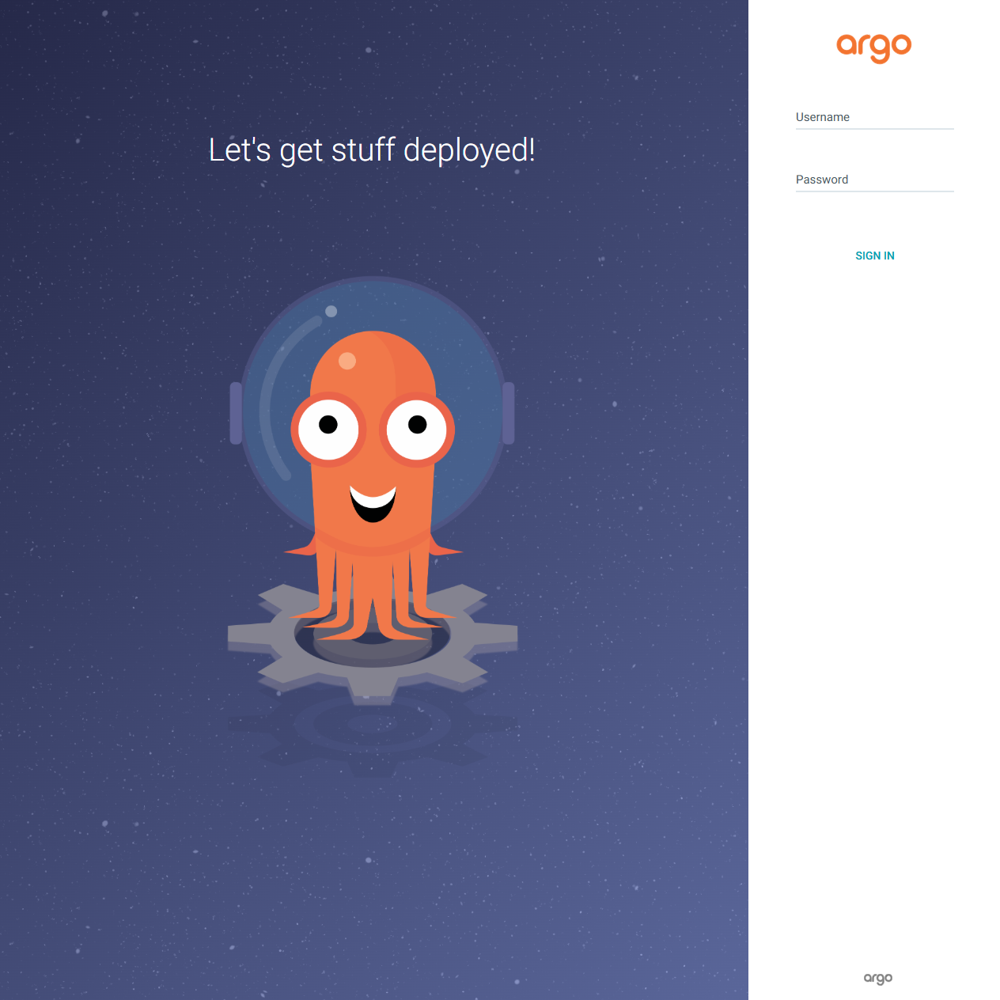

### 2.2.2. repository 연결

<strong>[ 대시보드 > Settings > CONNECT REPO ]</strong>를 클릭하여 repository 연결 페이지에 접속한다.

manifest repository와 연동하기 위한 과정으로 아래 내역을 입력한 후 **CONNECT** 버튼을 클릭하면 연결 정보가 생성된다.

1. **Name**: 연결 정보명(optional)
2. **Repository URL**: manifest repository의 URL
3. **Username**: 비공개 repository인 경우 입력 (optional)
4. **Password**: 비공개 repository인 경우 입력 (optional)

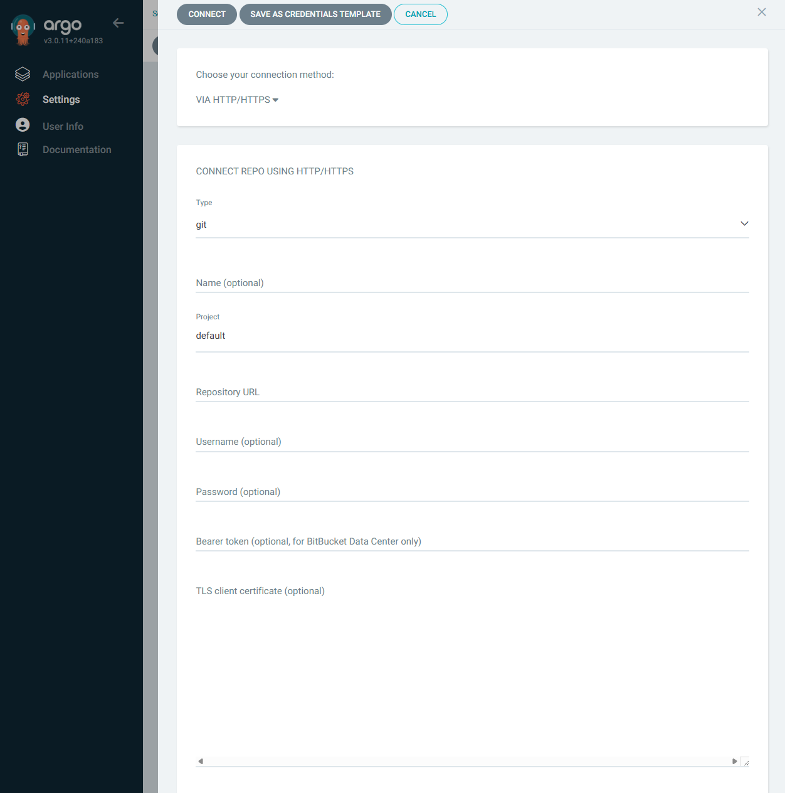

### 2.2.3. application 연동

<strong>[ 대시보드 > NEW APP ]</strong>을 클릭하여 application 연동 페이지에 접속한다. 

application 연동을 위한 과정으로 아래 내역을 입력한 후 **CREATE** 버튼을 클릭하면 연동 정보가 생성된다.

1. **Application Name**: 연동할 application명
2. **SYNC POLICY**: 자동으로 연동할 경우 Automatic 선택
3. **Repository URL**: 앞서 연결한 repository를 선택
4. **Path**: 연동할 application의 manifest 파일 경로
5. **Cluster URL**: 배포될 클러스터 선택
6. **Namespace**: 배포될 네임스페이스 선택

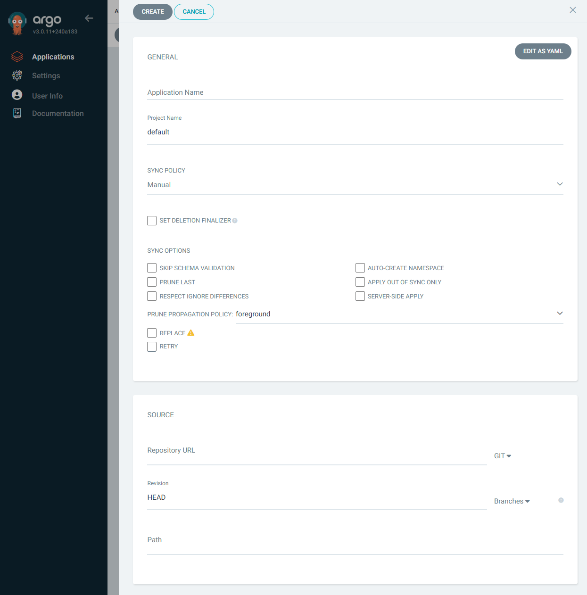

## 2.3. Jenkins 사용

### 2.3.1. 대시보드 접속

Jenkins 대시보드에 접속한다.

**Jenkins URL**: `http://<NODE PUBLIC IP>:<Jenkins NodePort>`

**사용자 로그인**

- Jenkins 배포 시 확인한 사용자 정보로 로그인한다.

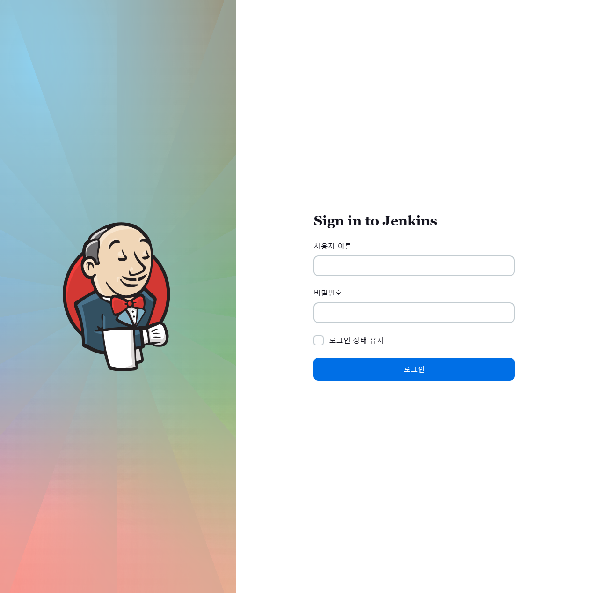

### 2.3.2. Credentials 등록

<strong>[ 대시보드 > Jenkins 관리 > Credentials > (global) > Add Credentials ]</strong>를 클릭하여 credential 등록 페이지에 접속한다.

Gitlab의 인증 정보를 안전하게 보관하기 위한 과정으로 **Create** 버튼을 클릭하면 credential이 생성된다.

#### Gitlab의 계정 정보를 등록한다.

1. **Kind**: Username with password 선택 
2. **Username**: Gitlab의 로그인 ID 입력
3. **Password**: Gitlab의 로그인 PW 입력
4. **ID**: 파이프라인에서 사용할 credential ID 입력

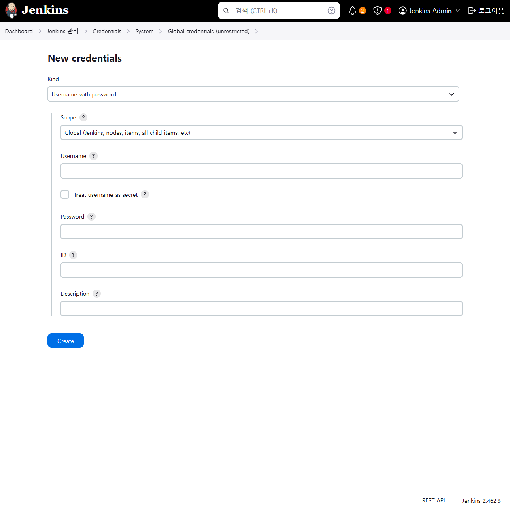

#### Gitlab에서 생성한 토큰을 등록한다.

1. **Kind**: Gitlab API token 선택 
2. **API token**: Gitlab에서 생성한 토큰 입력
3. **ID**: 파이프라인에서 사용할 credential ID 입력

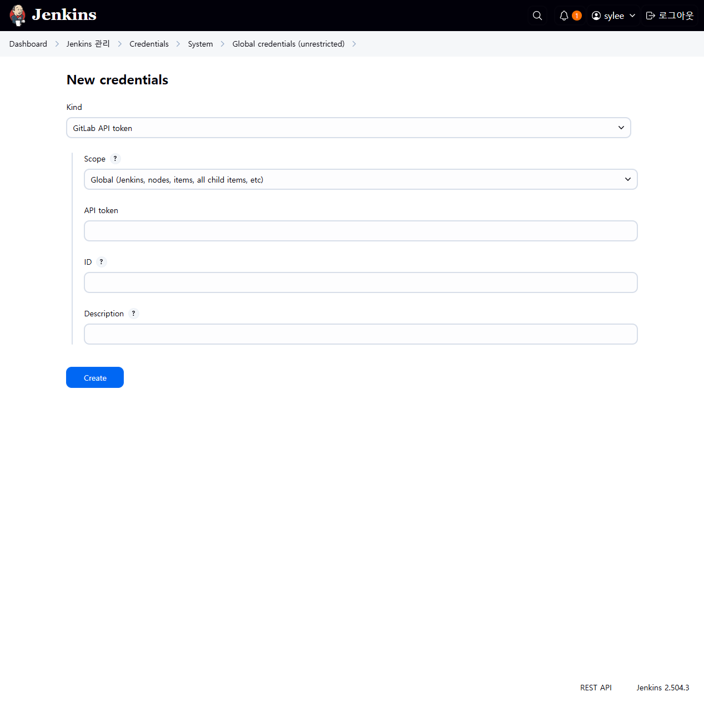

#### 이미지 저장소의 계정 정보를 등록한다.

1. **Kind**: Username with password 선택 
2. **Username**: 이미지 저장소의 로그인 ID 혹은 Access key 입력
3. **Password**: 이미지 저장소의 로그인 PW 혹은 Secret key 입력
4. **ID**: 파이프라인에서 사용할 credential ID 입력

### 2.3.3. Gitlab connection 등록

<strong>[ 대시보드 > Jenkins 관리 > System ]</strong>을 클릭하여 설정 페이지에 접속한다.

Gitlab과 연결하기 위한 과정으로 아래 내역을 입력하여 **Save** 버튼을 클릭하면 연결이 생성된다.

1. **Connection name**: 생성할 연결명 입력
2. **Gitlab host URL**: http://\<Node Public IP>:\<NodePort> 입력
3. **Credentials**: 앞에서 등록한 Gitlab api token을 선택

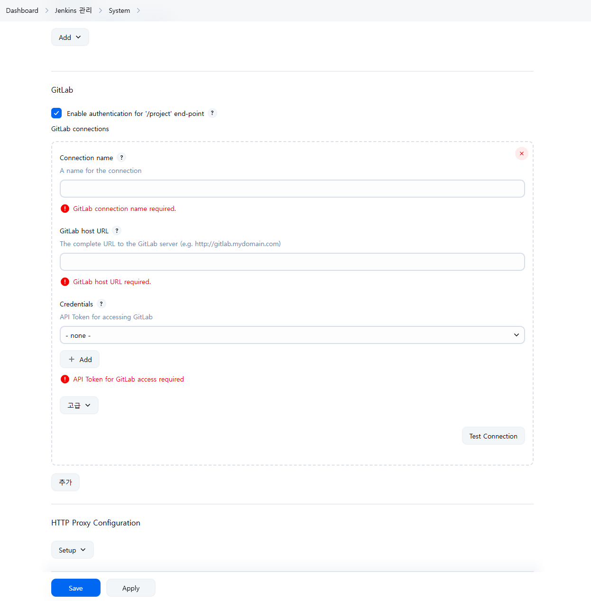

### 2.3.4. Pipeline 생성

<strong>[ 대시보드 > 새로운 Item ]</strong>을 클릭하여 아이템 생성 페이지에 접속한다.

파이프라인 생성을 위한 과정으로 아래 내역을 입력하여 **OK** 버튼을 클릭하면 아이템이 생성된다.

1. **item name**: 생성할 파이프라인명
2. **item type**: Pipeline 선택 

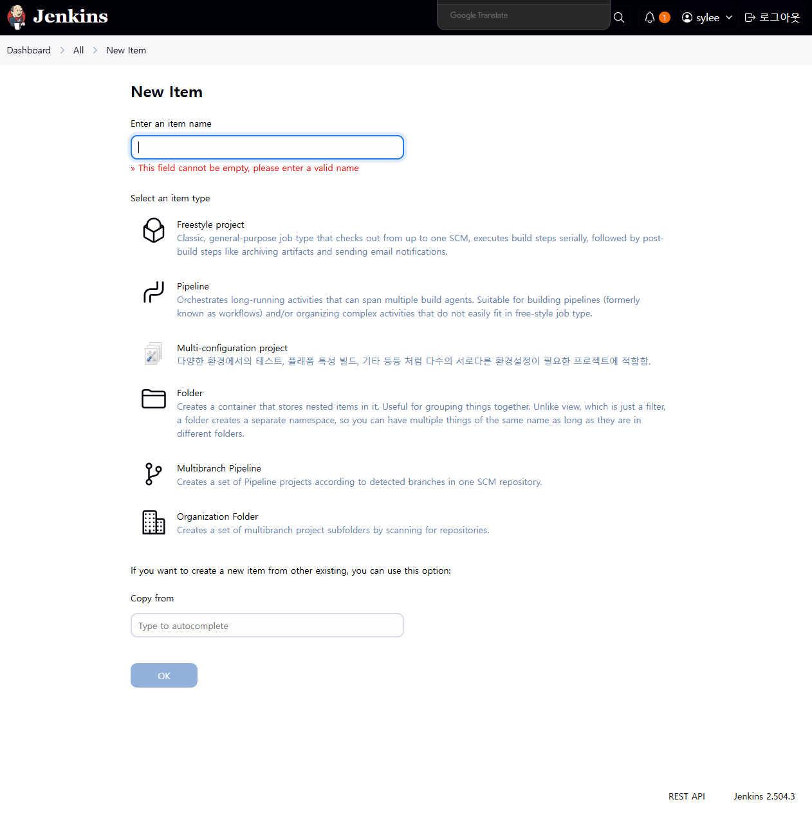

### 2.3.5. Pipeline 설정

<strong>[ 대시보드 > 생성한 파이프라인명 > 구성 ]</strong>을 클릭하여 파이프라인 관리 페이지에 접속한다.

파이프라인 설정을 위한 과정으로 아래 내역을 입력하여 **Save** 버튼을 클릭하면 설정이 저장된다.

1. **Gitlab Connection**:앞서 등록한 Gitlab connection명 선택
2. **Triggers**: Build when a change is pushed to GitLab 선택
    - Gitlab webhook URL을 Gitlab webhook 생성 시 입력 ([참고] [webhook 생성](#214-webhook-생성))
    - <string>[ Triggers > 고급 > Secret token > Generate ]</strong>을 클릭하여 생성된 토큰을 Gitlab webhook 생성 시 입력 ([참고] [webhook 생성](#214-webhook-생성))
3. **Pipeline script**: Jenkinsfile의 환경변수를 수정하여 입력

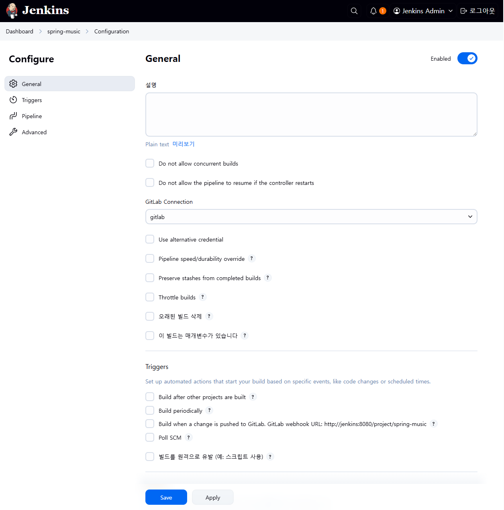

**Jenkinsfile 환경변수** 
|환경변수|설명|비고|
|---|---|---|
|IMAGE_NAME|해당 파이프라인의 이미지명||
|IMAGE_URL|이미지 저장소의 URL 입력|http:// 제외|
|MAJOR_VERSION|이미지의 major 버전 입력||
|MINOR_VERSION|이미지의 minor 버전 입력|기본값 : 파이프라인 실행 번호|
|IMAGE_CREDS|이미지 저장소의 credential||
|CODE_URL|소스 코드 저장소의 URL|http:// 제외|
|CODE_BRANCH|소스 코드 저장소 브랜치명||
|CODE_CREDENTIAL|소스코드 저장소의 credential||
|MANIFEST_URL|매니페스트 저장소의 URL|http:// 제외|
|MANIFEST_BRANCH|매니페스트 저장소 브랜치명||
|MANIFEST_CREDENTIAL|매니페스트 저장소의 credential||
|USER_NAME|commit할 사용자명||
|USER_EMAIL|commit할 사용자의 이메일||
|MANIFEST_DIR|업데이트할 manifest 파일의 경로||
|MANIFEST_NAME|업데이트할 manifest 파일명||
